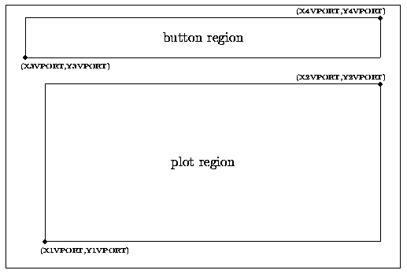

Library description
===================

*button* depends on PGPLOT
--------------------------

The **button** library has been built based on the graphic subroutine package
PGPLOT. In fact, the PGPLOT subroutine

::

   PGBAND(MODE,POSN,XREF,YREF,XC,YC,CH) 

is the nucleus of the **button** system. This subroutine, which governs the
utilization of a mouse device, returns the cursor position ``(XC,YC)`` in world
coordinates, and the character ``(CH)`` typed by the user on the keyboard or
mouse button clicked (a three button mouse returns ``CH='A'`` --left button--,
``CH='D'`` --middle button--, ``CH='X'`` --right button--).

**button** routines are completely compatible with the PGPLOT routines,
exception made for ``PGBEGIN``, which must be replaced by its **button**
version ``RPGBEGIN``. Other PGPLOT routines, like ``PGENV``, ``PGBAND``, and
``PGERAS`` are not recommended, and their counterparts ``RPGENV``, ``RPGBAND``
and ``RPGERAS`` (``RPGERASB`` and ``RPGERASW``) should be employed instead. The
convention employed to name these **button** routines is similar to that used
in PGPLOT, although an extra 'R' character has been added at the beginning of
the each routine name to facilitate the distinction with the PGPLOT routines.

Another set of additional **button** routines (``IFBUTTON``, ``BUTTON``,
``BUTTQBR``, ..., ``BUTTSYTEXT``) allow button manipulation, plotting the
buttons in different modes and detecting their selection.

Plotting settings
-----------------

The appearance of buttons and plots using **button** depend on the values of a
set of environment variables (all of them declared in the file ``button.inc``).
These variables govern the size and location of buttons and plots, and can be
changed at running time in a straightforward way by performing calls to
subroutines.

The following table shows a list of the environment variables, together with a
short description, their defaults values (established in the initial call to
the routine ``RPGBEGIN``), and the routines employed to query and set their
current values.

.. math::

   \begin{array}{cclcc}
   \mbox{MAX\_XBUTT}   & 6       & 
   \mbox{number of buttons in the x direction} & \mbox{BUTTQXB} & \mbox{BUTTSXB} \\
   \mbox{MAX\_YBUTT}   & 2       & 
   \mbox{number of buttons in the y direction} & \mbox{BUTTQYB} & \mbox{BUTTSYB} \\
   \mbox{PGSCF\_BUTT}  & 2       & \mbox{PGPLOT font type for text in buttons} & 
   \mbox{BUTTQCF} & \mbox{BUTTSCF} \\
   \mbox{PGSCH\_BUTT}  & 1.0     & \mbox{PGPLOT font size for text in buttons} & 
   \mbox{BUTTQCH} & \mbox{BUTTSCH} \\
   \mbox{YTEXT\_BUTT}  & 0.35    & \mbox{relative y-position of the text baseline in buttons} & 
   \mbox{BUTTQYTEXT} & \mbox{BUTTSYTEXT} \\
   \mbox{ITICKS\_BUTT} & \mbox{.FALSE.} & 
   \mbox{if .TRUE. invert the tick marks (draw them outside the plot instead of inside)} & 
   \mbox{BUTTQIT} & \mbox{BUTTSIT} \\
   \mbox{X1VPORT}     & 0.10    & 
   \mbox{x-coordinate of the left hand edge of the plot region (in normalized device coordinates, from 0 to 1)} & 
   \mbox{BUTTQPR} & \mbox{BUTTSPR} \\
   \mbox{X2VPORT}     & 0.95    & \mbox{x-coordinate of the right hand edge of the plot region} & 
   \mbox{BUTTQPR} & \mbox{BUTTSPR} \\
   \mbox{Y1VPORT}     & 0.10    & \mbox{y-coordinate of the bottom edge of the plot region} & 
   \mbox{BUTTQPR} & \mbox{BUTTSPR} \\
   \mbox{Y2VPORT}     & 0.70    & \mbox{y-coordinate of the top edge of the plot region} & 
   \mbox{BUTTQPR} & \mbox{BUTTSPR} \\
   \mbox{X3VPORT}     & 0.05    & \mbox{x-coordinate of the left hand edge of the button region} & 
   \mbox{BUTTQBR} & \mbox{BUTTSBR} \\
   \mbox{X4VPORT}     & 0.95    & \mbox{x-coordinate of the right hand edge of the button region} & 
   \mbox{BUTTQBR} & \mbox{BUTTSBR} \\
   \mbox{Y3VPORT}     & 0.80    & \mbox{y-coordinate of the bottom edge of the button region} & 
   \mbox{BUTTQBR} & \mbox{BUTTSBR} \\
   \mbox{Y4VPORT}     & 0.95    & \mbox{y-coordinate of the top edge of the button region} & 
   \mbox{BUTTQBR} & \mbox{BUTTSBR} \\
   \end{array}

Using **button**
----------------

With these default values, the aspect of the plot and button regions is that
shown in the following diagram:

Any call to ``RPGENV`` will produce a graph in the plot region. The button area
is divided into ``MAX_XBUTT`` columns and ``MAX_YBUTT`` rows of buttons, which
define ``MAX_XBUTT x MAX_XBUTT`` possible buttons. The maximum number of
buttons is limited to 1000 (although this limit can be modified by varying the
parameter ``MAX_NBUTT`` in the file button.inc.

In practice, any program that will made use of these buttons, must contain and
initial call to the subroutine ``RPGBEGIN``, which determines the number of
simultaneous output devices to be employed, and sets the default values of the
environment variables. After this inicial call, all the PGPLOT routines
(exception made for ``PGBEGIN``) can be employed, in addition to those of
**button**.

Each button is identified with a number, corresponding to their position on the
grid of ``MAX_XBUTT x MAX_XBUTT`` possible buttons. Calls to the subroutine
**button** will display/erase buttons in different modes. The detection of a
selected button by the program user is performed with a call to a couple of
subroutines:

::

   CALL RPGBAND(MODE,POSN,XREF,YREF,XC,YC,CH)
   CALL IFBUTTON(XC,YC,NB)

As we explained previously, ``RPGBAND`` return the current cursor position
``(XC,YC)`` and the pressed mouse button ``(CH)``. ``IFBUTTON`` determines
whether the cursor location corresponds to an activated button. If this is the
case, ``NB`` returns with the number corresponding to the selected button, or
cero if the cursor is not located on any button.

NOTE: since the subroutine ``RPGERAS`` only clears the plot region, if labels
are drawn outside this region, they are not cleared. In this case it is more
convenient to use the subroutine ``RPGERASW`` (see sample program).

A sample program
----------------

The sample program ``samplebutton.f``, included in the distribution file, shows
some of the capabilities of the **button** library. Note that this program also
incorporates an algorithm to handle, simultaneously, different graphic output
devices. However, it is important to note that, if more than one single graphic
device is going to be employed, buttons (in this sample program) will only be
displayed in the first selected graphic device.

Buttons can be employed graphically or in text mode.

Graphic buttons
...............

::

   $ src/samplebutton
   Are you using graphic buttons............(y/n) [y] ? y
   Graphic device #1 (? to see list) [/XSERVE] ? /XSERVE
   Graphic device #2 (NONE=EXIT) (? to see list) [NONE] ? NONE
           .
           .
           .
           .
   Press [CR] to EXIT

Text buttons
............

In this case, buttons appear in the terminal (VT type), instead that in the
graphic output device. If MAX_XBUTT=6, which is the default value, it is
necessary to change the terminal width to 132 characters per line.

::

   $ src/samplebutton
   Are you using graphic buttons............(y/n) [y] ? n
   Do you want to plot the buttons anyway...(y/n) [y] ? n
   Graphic device #1 (? to see list) [/XSERVE] ? /XSERVE
   Graphic device #2 (NONE=EXIT) (? to see list) [NONE] ? NONE
    
   Are you pressing a button (y/n) [y] ? y
   Button number [0] ? 1
           .
           .
           .
           .
   Are you pressing a button (y/n) [y] ? y
   Button number [0] ? 6
    
   Press [CR] to EXIT
   
